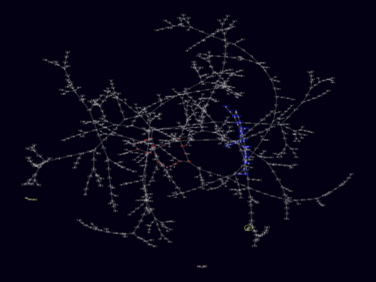

# &pi;-chain

Pi chain is a little game for the super nerd who has memorized Pi. A pi chain is a 
series of numbers created by a number at any given decimal digit of pi and using 
the decimal digits of pi to determine the next number in the chain. You can play 
single-digit pi chain with the first 9 decimal digits of pi, double-digit pi chain 
with the first 99 decimal digits of pi, or triple-digit pi chain with the first 
999 decimal digits of pi.

For example, starting with the number 4, a single-digit pi chain would be the 
series: 4, 5, 9, 3, 1. This is because the 4th decimal digit is 5, the 5th is 9,
the 9th is 3, the 3rd is 1, and then the 1 repeats infinitely.

For two-digit pi chain, starting with 37, the two digits at the 37th decimal 
digit of pi are 19, at the 19th decimal digit of pi you find 46, and at the 
46th decimal digit of pi, you find 37, which means you've found a 3-link loop.

For three-digit pi chain, you start with any random number from 1 to 999 and 
use the three digits of pi at that position to determine the next link in the 
pi chain.
